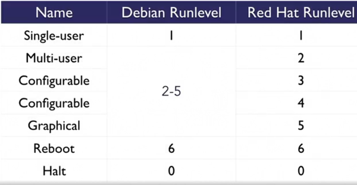
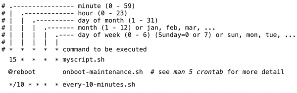
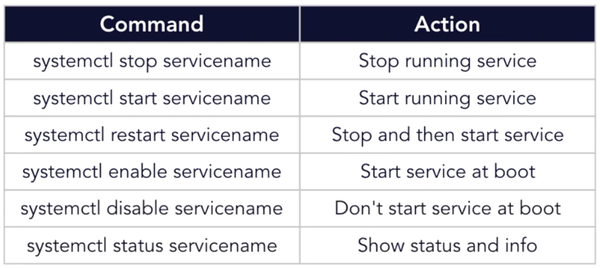
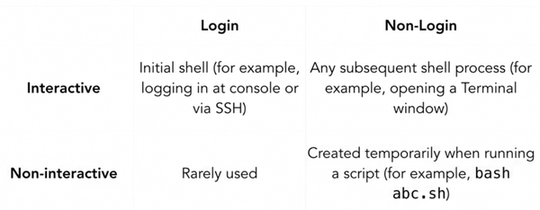
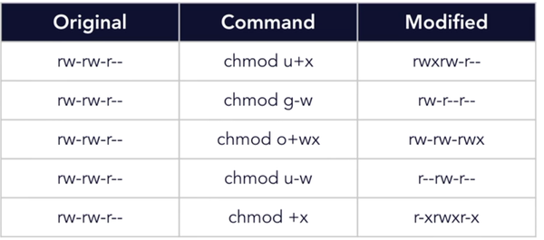
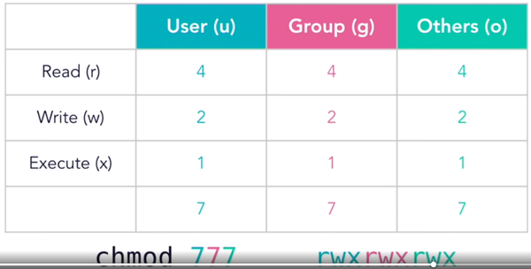
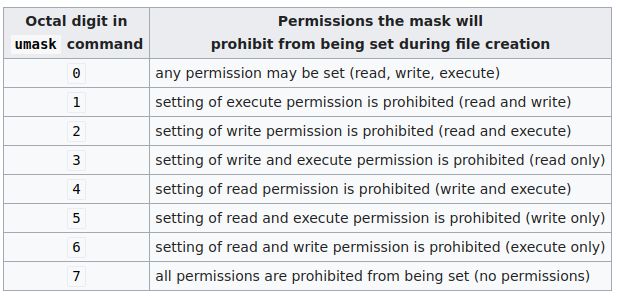
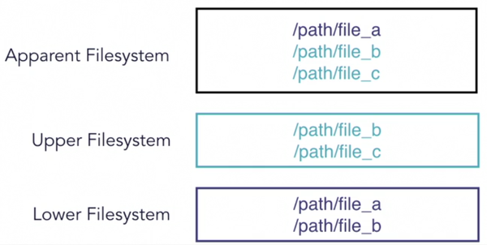
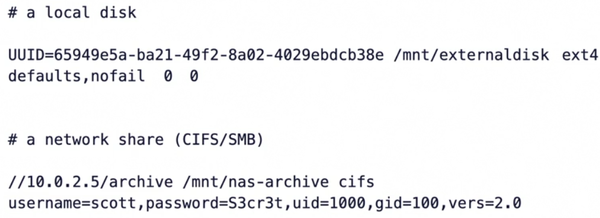

# Linux notes

Linux notes and a lose follow-along of linux tips weekly on linkedin learning by Scott Simpson

## Follow along of linux tips weekly

### Foundations

#### Distributions and derivatives

- Red Hat Enterprise Linux (RHEL)
  - commercial server enterprise linux with branding and commercial support 
  - Derivatives
    - CentOS: 
      - Free (and without commercial support) Server alternative to and derived from Red Hat Enterprise Linux.
      - each release is supported for 10 years 
      - PM (packet manager): rmp + yum front end
    - Fedora
      - used to evaluate what might be added to RHEL
      - cutting edge features, short support window
      - for developers, needs troubleshooting
      - PM: dnf
    - others: Scientific Linux, Oracle Linux, Amazon Linux
- Debian
  - Derivatives:
    - Ubuntu
      - focuses on ease of use
      - desktop, server, power- and casual users
      - GNOME desktop (since 2018)
      - 2 releases per year, 2nd one with long term support release (LTS)
      - PM: dpkg and apt
      - Ubuntu itself has many derivatives
    - Mint
      - based on the current Ubuntu LTS release 
      - Focus: ease of use and media compatibility
      - includes some closed-source software
    - others: Raspbian, SteamOS, Kali, ...
- Suse
  - OpenSUSE / SUSE Linux enterprise 
- Many others not derived distros, notably
  - alpine: minimalism and security, popular as small docker image base 
  - arch linux: steep learning curve but excellent documentation
  - gentoo
  - Android
  - ChromeOS (based on Gentoo)
  - macOS - not linux but BSD based

#### Core utilities (GNU coreutils)

A standard set of commands that are present in virtually all linux distros (sometimes replaced by the busybox 
package with similar commands). They can be shown using `apt show coreutils`:

    [...]
    arch base64 basename cat chcon chgrp chmod chown chroot cksum comm cp
    csplit cut date dd df dir dircolors dirname du echo env expand expr
    factor false flock fmt fold groups head hostid id install join link ln
    logname ls md5sum mkdir mkfifo mknod mktemp mv nice nl nohup nproc numfmt
    od paste pathchk pinky pr printenv printf ptx pwd readlink realpath rm
    rmdir runcon sha*sum seq shred sleep sort split stat stty sum sync tac
    tail tee test timeout touch tr true truncate tsort tty uname unexpand
    uniq unlink users vdir wc who whoami yes

Install location varies by distro, in Linux Mint they are located in `usr/bin`. Sometimes these are replaced by 
similar commands built into the shell.

Further info can be obtained by `man [command]` or `info coreutils`; also see [cheat.sh](#cheatsh) below.

#### Linux on a virtual private server

azure / google cloud / digitalocean

Digital ocean terminology: droplet = virtual machine

Example First steps for securing a vps on a digitalocean droplet:

    # enable firewall and only enable ssh port for now
    # USE THIS ORDER or the firewall will kick you out of the ssh session
    ufw allow 22/tcp
    ufw enable
    # program to keep track of failed login attempts
    apt install fail2ban
    # create a user beside root user
    adduser username
    # add to admin group
    usermod -aG sudo username
    # switch to user 
    su username
    # add ssh key for user
    mkdir ssh
    nano .ssh/authorized_keys
    # paste public key into the file created in digitalocean UI

### System basics

#### File system

- provides a predictable location for files across distributions
- Bases filesystem at `/` (root)
- data can be relocated to other discs and remain in the same place in the filesystem

##### Folder Overview
    /               Filesystem root
    ├── bin         Binaries the system needs incl. shell, ls, cat...
    ├── boot        Kernel and initial ram disk
    ├── dev         References do system devices
    ├── etc         Configuration files (e.g. apache, x11, hosts file etc)
    ├── home        Users home folder
    ├── lib         Libraries associated with system binaries
    ├── media       Mount point for removable media
    ├── mnt         Mount point for HDs, network shares etc
    ├── opt         User installed software
    ├── proc        Represents kernel and process information as files
    ├── root        Home folder for root user (why is there android / snap stuff here?)
    ├── run         Information about running processes (PIDs, locks etc)
    ├── sbin        System binaries
    ├── srv         Files served by the system (by ftp or other)
    ├── sys         Represents parts of the system (fs, devices, etc)
    ├── tmp         Temporary info / files (with lose permissions)
    ├── usr         Another location for system and user binaries
    ├── var         Files that can vary (logs etc) but are not temporary

##### PATH

The `PATH` variable stores where the system looks for binaries when a command is entered in the shell.

    echo $PATH
    /usr/local/sbin:/usr/local/bin:/usr/sbin:/usr/bin:/sbin:/bin:/usr/games:/usr/local/games:/snap/bin

##### Useful filesystem related commands

- `which [command]` shows the file in the path that's being used for a given command:
- `locate [string or regex]` fast search outside the PATH; underlying database can be stale; daily updated. When using locate 
  '*.h', only files that *end with* `.h` are found, not .html. Without the brackets, also .html, .hash etc. are found.
- `find [string or regex` slower but live checks all files

#### Command line and useful commands to search for commands

- General command pattern: `command options arguments`
- Use `\` for line continuation at the end of the line or escape characters
- Use `apropos [search term]` to show commands with descriptions that contain the search term, e.g. `apropos tree`
- To find out more about a command, use `man [command]` or for the youtube generation `curl cheat.sh/[command]

#### Keyboard shortcuts

- `Ctrl-C`: Ends a task
- `Ctrl-A` / Ctrl-E: Jump to start / end of line respectively
- `Ctrl-Z`: Suspend a task (use `jobs` to see and `fg` (foreground) and `bg` (background) to manipulate them). For 
  example, while editing something in nano or vim, press `ctrl-z`, do whatever needs to be done in the shell and 
  then type `fg` to get back into the suspended editor
- `Ctrl-D`: End of file / end of input
- Copy / cut / paste related: use ctrl+shift instead of just shift with the usual secondary keys, e.g. ctrl-shift-x 
  to cut

#### Sudo access and root

- Root is the superuser, no restrictions on any file
- Is used to perform administrative tasks
- User ID is always 0
- Logging in as user is not recommended
- use `sudo` to access the superusers privileges temporary with other users
  - sudo users / groups are defined in /etc/sudoers
  - the file MUST be edited with visudo (`sudo visudo`) for syntax checking
  - Usage: `sudo [command]` to execute a single command as superuser
  - `sudo` with various options:
    - `sudo -i` run target users shell and switch into its home (usually `/root`)
    - `sudo -s` same but switch in invoking user's shell
    - `sudo -l` show sudo privileges of current user
    - `sudo -u` specify a user to operate as
  - Logs are kept of commands that are run with `sudo`
  - Five minute timer until reauthentication started on each sudo command
  - `sudo -k` expires the timer immediately

#### Exploring a system

- Find distro / relase with `cat /etc/*release`
- `hostnamectl` shows system hostname, kernel and related
- `uname -a` pretty much like hostnamectl but condensed into one line
- `uptime` uptime and system load in the past 1, 5 and 15 minutes (0-[systems number of cores]); if the number is 
  higher than the number of cores, the system can't keep up with demands. If higher, all is fine.
- `df -h` gives an overview of filesystem's disk space usage (`-h`for human readable)
- `free` ram / swap related information
- `who`  who else is logged on 
- `systemctl` system services and statuses; `systemctl | grep running` to show running services only. `systemctl 
  status [service]`, e.g. `systemctl status syslog` or `systemctl status docker` to show status and log of a running 
  service
- `top` shows processes / ressources.
  - `x` to highlight current sort column, choose column to sort by using `<` and `>`; `R` to reverse sort order; 
    `h`for help
- `ip a` or `ifconfig` for network information

#### Exploring bash

- Auto completion for commands, arguments or files with `tab` key; double-tab to show all possibilities that start with 
  the typed in substring.
  - Brace expansion (useful for e.g. creating a large number of files)

        pk@pk-lightshow:/$ echo h{e,a,u}llo
        hello hallo hullo
        pk@pk-lightshow:/$ echo h{a..c}llo
        hallo hbllo hcllo
        pk@pk-lightshow:/$ echo h{c..a}llo
        hcllo hbllo hallo
        pk@pk-lightshow:/$ echo h{1..3}llo
        h1llo h2llo h3llo
        # with interval
        pk@pk-lightshow:/$ echo h{0..100..25}llo
        h0llo h25llo h50llo h75llo h100llo
        pk@pk-lightshow:/$ echo {a..z}{a..z}{0..9}
        pk@pk-lightshow:~/projects$ echo {a..z}{a..z}{0..9}
        aa0 aa1 aa2 aa3 aa4 aa5 aa6 aa7 aa8 aa9 ab0 ab1 ab2 ab3 ab4 ab5 ab6 ab7 ab8 ab9 ac0 ac1 ac2 ac3 ac4 ac5 ac6 ac7
        ac8 ac9 ad0 ad1 ad2 ad3 ad4 ad5 [...]

- command substitution: `$([command])` or `` `[command]` `` takes output of command and return it as a string., e.g. 
  `echo it is $(date)` or ``echo it is `[date]` ``
- `Ctrl-R`: type command / search term and press ctrl-r to cycle through command line history; press enter to redo
    current command or tab to edit before executing
- show command `history` and execute a line from it using `![nr]`, e.g. `!150`
- execute previous command with `!!`. Good when forgetting to sudo a command: `sudo !!` 

#### Bash scripting basics

Executable scripts start `#!`(*shebang*) with the path to the interpreter, e.g. `#!/usr/bin/python`.

In case of bash scripts, this is `#!/usr/bin/env bash` (why env bash?).

Scripts can be run using `bash script.sh` or directly when made executable by setting the executable bit (`chmod +x 
script.sh`).

Example script:

    #!/usr/bin/env bash
    myvar=42
    # read variable with a prompt
    read -p "What is your name? " name
    # variables are refered to with a dollar sign
    echo "Hello, $name, the meaning of life is $myvar"
    # command substitution as usual
    echo "And the date is $(date)"

#### The bash prompt

Usual format: `username@hostname:currentDirectory$`, e.g. `pk@pk-lightshow:~/projects/linux$`

The prompt can be set using the PS1 environment variable in the ~/.bashrc file

    echo $PS1
    \[\e]0;\u@\h: \w\a\]${debian_chroot:+($debian_chroot)}\[\033[01;32m\]\u@\h\[\033[00m\]:\[\033[01;34m\]\w\[\033[00m\]\$

[online bashrc prompt generator](http://bashrcgenerator.com/)

To temporarily (only in the current session), use `export PS1="[prompt code]"`

e.g.

    pk@pk-lightshow:~$ export PS1="\[\033[38;5;12m\]\u\[$(tput sgr0)\]\w:\[$(tput sgr0)\]"
    pk~:

PS2 defines the prompt displayed for line continuation.

#### Bash output redirection

3 basic streams: 0 stdin (default: keyboard input), 1 stdout (terminal), 2 stderr (terminal).

Redirectors:

- `|` pipe output to a command, e.g. `ls -l | grep doc` to show only directory names containing "doc"
- `>` redirect output to a file (replace content if it exists)
- `>>` redirect output and append to a file
- `<` use file as input
- `<<` take input until token: `wc << EOF` reads input until end of file (ctrl-D, or "EOF")

      pk@pk-lightshow:~$ wc << EOF
      > blab blubb
      > EOF
      1  2 11

Example of finding files but redirecting all error messages (as the user doesn't have access to all folders) to null:

    find / -name "linux"  2>/dev/null

#### Bash expansion and substitution

Same as under [exploring bash](#exploring-bash).

Create 30 files with expansion

    pk@pk-lightshow:~/tmp$ touch file{a..c}{1..10}.log
    pk@pk-lightshow:~/tmp$ ls
    filea10.log  filea5.log  fileb10.log  fileb5.log  filec10.log  filec5.log
    [...]

Create multiple directories:

    mkdir /home/pk/tmp/{logs,cache,wads}
    mkdir -p /home/pk/tmp/{a..z}/{1-100}/{z..a}

- `~` = user's homefolder (e.g. `/home/pk`)
- `$(command)` -> command substitution (command output can be used as argument)

#### Bash aliases and functions

Both aliases and functions have to be added to the .bashrc file to be permanent of course.

##### Aliases

- `alias lg="ls -l --group-directories-first"` assigns the ls command with parameters to the `lg` alias
- `alias` shows assigned command aliases
- `alias [command]` shows specific alias information (e.g. `alias ll`)
- if a command is overwritten with an alias, the original command can be executed with a `\`, e.g. `\ls`
- remove with `unalias [command]`

##### Functions

`function greplog () { grep $1 /var/log/syslog; }`

#### Bash arithmetic and equality operators

Arithmetics (ONLY integers) must be enclosed by two brackets:

    pk@pk-lightshow:~/tmp$ echo $(( 2**16 ))
    65536

Supported operators: `+, -, *, /, **, %`

Equality operators in a nutshell:

Boolean operators to check files and folders:
    
    # the spaces before and after [ and ] are important!
    if [ -e myfile ]; then echo "file exists"; fi

    # spacecheck.sh
    #!/usr/bin/env bash
    space=$(df -k / | awk 'FNR == 2 {print 4}')
    if [ $space -lt $((50*1000*1000)) ]
    then
      echo "/ has LESS than 50 GB available"
    else
      echo "/ has MORE than 50 GB available"
    fi

#### System logs

- keep track of system activity
  - Debian: /var/log/syslog
  - Red Hat: /var/log/messages
- Other application logs
  - Package manager: `/var/log/dpkg.log`
  - Activites requiring authorization: `/var/log/auth.log`
  - etc.

Using `less` to view a log, we can use `f` and `b` to go forward and backward, `/` to search, enter for next match, 
`/` + enter for new search. Show only lines containing a search term by typing `&/searchterm`, to exit `&` again.

System logs are handled by `rsyslogd`, which can be configured in `/etc/rsyslog.conf`.

We can write to the system logs by using `logger`:

    pk@pk-lightshow:~/tmp$ logger "hey there"
    pk@pk-lightshow:~/tmp$ tail -1 /var/log/syslog
    Aug 25 18:28:14 pk-lightshow pk: hey there

`rsyslog` can be configured to send and accept logs over the network.

Logs rotate and get archived into compressed files, this can be configured in `/etc/logrotate.conf` and 
`/etc/logrotate.d`.

Archived files can be viewed with `zcat` and `zless`

#### System startup

POST + boot -> Bootloader (Grub, LILO) -> Startup (SysV Init, Systemd)

First, the system's firmware locates bootable instructions on media and executes them.

Then, the bootable code loads further bootable software.

#### Grub

- Grand Unified Bootloader
- provides a menu for user-configurable boot options, an interactive shell and troubleshooting options.
- Grub then loads the kernel from the /boot filesystem and hands off control.
- Will look automatically to other bootable OSs on the system
- 
Configuration options:

- Scripts in `/etc/grub.d`, configuration file in `/etc/default/grub`
- changes must be prepared with `grub2-mkconfig`

#### SysV init

- Initialization system responsible for starting and controlling processes. Most current distros use `Systemd`.
- Init runs as PID 1 and is the parent process of all other processes on the system.
- Runlevels represent discrete operational states: . Runlevel can be 
  viewed with `runlevel`, which shows the previous (N=none) and current runlevel. A runlevel can be set with `init`. 
- Each runlevel has scripts to be run at specific runlevels in `/etc/init.d`.
- The scripts provide a header to indicate at which runlevel they should be started / stopped:

      ### BEGIN INIT INFO
      # Provides:          rsyncd
      # Required-Start:    $remote_fs $syslog
      # Required-Stop:     $remote_fs $syslog
      # Should-Start:      $named autofs
      # Default-Start:     2 3 4 5
      # Default-Stop:
      # Short-Description: fast remote file copy program daemon
      # Description:       rsync is a program that allows files to be copied to and
      #                    from remote machines in much the same way as rcp.
      #                    This provides rsyncd daemon functionality.
      ### END INIT INFO

- The scripts are linked into directories `/etc/rc0.d` to `/etc/rc6.d` corresponding to their runlevels. Links 
  starting with "S" indicate that the "start" section of the script should be run at the specific runlevel, a "k" 
  means the script should be killed at this runlevel. The number behind the letter indicates the relative order the 
  scripts should be run in.

    pk@pk-lightshow:/etc$ ls -l rc4.d/
    total 0
    lrwxrwxrwx 1 root root 17 Aug  7 18:04 K01apache2 -> ../init.d/apache2
    lrwxrwxrwx 1 root root 29 Aug  7 18:04 K01apache-htcacheclean -> ../init.d/apache-htcacheclean
    lrwxrwxrwx 1 root root 15 Sep  6  2019 S01acpid -> ../init.d/acpid
    lrwxrwxrwx 1 root root 17 Sep  6  2019 S01anacron -> ../init.d/anacron
    lrwxrwxrwx 1 root root 22 Sep  6  2019 S01avahi-daemon -> ../init.d/avahi-daemon
    lrwxrwxrwx 1 root root 19 Sep  6  2019 S01bluetooth -> ../init.d/bluetooth
    [...]

- Own scripts can be put into `/etc/rc.local` (*seems to be missing in mint?*)
- The scripts can be run by hand using `sudo service [servicename] [args]`, e.g. `sudo service networking restart`

#### Systemd

- System and service manager used by most linux system
- acts as init system during startup (and replaces SysV)
- Manages services after a system has started

- After kernel startup, systemd takes responisibility for starting process
- Starts as PID 1, parent of all other processes
- Takes the system through various targets (the equivalent to runlevels) to the desired state / target (usually 
  "graphical")
- Targets are composed of units which each define a process a service; units can run in parallel, speeding up the 
  startup process.

Noteworthy targets:

- Emergency: read-only root filesystem access and basic tools
- Recue: r/w filesystem and some system services

Units can be viewed, stopped, started, enabled and disabled with `systemctl`, a specific unit with `systemctl status 
[unitname]`.

#### Cron

- Runs tasks periodically.
- reads a list of tasks every minute and runs them appropriately
- cron reads from 3 places:
  - /var/spool/cron
  - /etc/cron.d
  - /etc/crontab
    - the default entries here refer to directories with shell scrips in e.g. `/etc/cron.daily`
    - User scripts can be put in these directories
  - Root scripts with specific timings should be put into `/etc/cron.d`
  - User scripts can be added with `crontab -e`, which starts an editor with a nice template

Crontab format

Cron tasks only run when the system is powered on; when it's off during the scheduled time, it doesn't catch up and 
runs scripts scheduled earlier when it's turned on. For this, `anacron` is used. Anacron rus daily, while cron runs 
every minute.
Tasks for anachron are defined in `/etc/anacrontab`

#### chroot

- Isolates a process from the rest of the filesystem
- sets an effective root directory the process can't see out of
- anything needed to run must be present in the chroot, typically `/sys, /proc, /bin` need to be mountet in the new 
  chroot directory
- copy needed files into place
- to see what dependencies a program has, use `ldd`

      pk@pk-lightshow:/etc/cron.d$ ldd /bin/bash
      linux-vdso.so.1 (0x00007ffdcfbf4000)
      libtinfo.so.5 => /lib/x86_64-linux-gnu/libtinfo.so.5 (0x00007fa7cc701000)
      libdl.so.2 => /lib/x86_64-linux-gnu/libdl.so.2 (0x00007fa7cc4fd000)
      libc.so.6 => /lib/x86_64-linux-gnu/libc.so.6 (0x00007fa7cc10c000)
      /lib64/ld-linux-x86-64.so.2 (0x00007fa7ccc45000)

- often used for system rescue / live boot or test software only with defined dependencies

#### User and group management

- Users = humans or services
- groups: organizational units of users
- Users are defined in `/etc/passwd`
- users with id 1000+ are regular / human users
- File rights are based on the numeric user ID, not the login name! So be careful when deleting and adding a user 
  with the same numeric ID.

/etc/passwd:

`[username]:[user has encrypted password in /etc/shadow file]:[userID]:[id of primary groups of user]:[gecos (name, 
phone etc)]:[users home folder]:[users shell]`

e.g. `pk:x:1000:1000:pk,,,:/home/pk:/bin/bash`

/etc/shadow:

`[username]:[encrypted password OR *=disabled, !=locked]:[days since last pw change]:... other expiry settings`

e.g. `cups-pk-helper:*:18106:0:99999:7:::`

/etc/group:

`[groupname]:[group password, unused]:[comma separated usernames]

Commands to show user or group info: `id`, `groups`, `getent [group|services|passwd|...]`

- Adding a user: `sudo adduser [username]` creates user, group and home from `/etc/skel` home folder template
- Adding a group: `sudo addgroup [groupname]`
- Add user to group (and other user related tasks): `sudo usermod -aG [groupname] [username]`; example (add user to 
  sudo group): `sudo usermod -aG sudo pk`
- `usermod` is used to all other user related tasks (change login name, password etc.).
- Change user password with `passwd`.
- Delete group / user with `delgroup` / `deluser` (home dir will still exist)

#### Service management

- managed by system (systemd), managed by user by `systemctl`. Info on units (see [systemd](#systemd) section).
- Unit configuration files in `/lib/systemd/system/`, e.g. `/lib/systemd/system/rsyslog.service`; own units can be 
  added here as well.  

Common systemctl commands:

#### Backup with rsync

- copies files from a to b
- synchronize folders
- skip unchanged files

- Basic incremental backup: `rsync -avz * /media/pk/usb-disk`
- rsync can use network and remote paths

#### Splitting and combining files

    pk@pk-lightshow:~/Pictures/sky$ md5sum sky.jpg
    a02179066495e5ed4303336170845d6a  sky.jpg
    pk@pk-lightshow:~/Pictures/sky$ split -b 100KB sky.jpg -d sky.jpg.part
    pk@pk-lightshow:~/Pictures/sky$ ls
    sky.jpg         sky.jpg.part01  sky.jpg.part03  sky.jpg.part05
    sky.jpg.part00  sky.jpg.part02  sky.jpg.part04
    pk@pk-lightshow:~/Pictures/sky$ cat $( ls sky.jpg.part* ) >> sky_reassembled.jpgpk@pk-lightshow:~/Pictures/sky$ echo "a02179066495e5ed4303336170845d6a  sky.jpg" | md5sum -c
    sky.jpg: OK

#### Environment configuration files

Types of shells:

File(s) read by bash:

- Login shell: *one of* (the first found in `~/`)
  - /etc/profile
  - ~/.bash_profile
  - ~/.bash_login
  - ~/.profile # non-bash settings, like PATH variable etc

- Non-Login shell ("*rc" = "run commands")
  - /etc/bash.bashrc # system settings
  - ~/.bashrc # user level settings, bash related settings such as PS1, aliases etc

The scripts usually reference each other, so login shells include settings from non-login shells and vice versa 
(probably not true generalized like this)

Additional definitions read by /etc/profile in `/etc/profile.d`

#### Dotfiles

User customized configuration files and directories in home folder such as `~/.profile`, `~/.vimrc`, `~/.ssh/`.

They can be re-read in the current shell using e.g. `source .profile`.

#### Path variable explored

- `$PATH` contains directories where the shell looks for **executables** (in the order they are defined; use `which 
[command]` to see which one is executed). 
- The initial PATH comes from /etc/environment
- Add paths (temporarily in the shell) with `export PATH=[new directory]:$PATH` or `$PATH:[new directory]` to add it to 
the end.
- Use `PATH=[directory]:$PATH` in `.profile` for permanent paths for the current user.
- These don't affect sudo commands. Change the sudoer path with `sudo visudo`.

#### Browsing with the directory stack

- Using `cd`
  - `cd` to go to user's home dir, 
  - `cd -` to go to the previous directory
    - Using the directory stack
      - Create a list of directories to move between quickly
      - add directories with `pushd` and remove with `popd`, view with `dirs`, clear with `dirs -c`

#### Finding and locating files

- `find` actively searches (with the user rights), e.g. `find / -name "*.png"`
- `locate` uses a daily updated file database (force update with `sudo updatedb`), e.g. `locate -i *.png` (`-i` = case 
  insensitive); use `-b` to 
  indicate that the file should *start* with the search string (as opposed to being a substring).

#### Working with swap 

- swap space can be file or partition
- `swapon` manages / shows (`-v`option) swap ressources, `swapoff` removes resources from the swap pool, `mkswap` 
  sets up a file or partition as swap

Adding a file to the swap pool:

    # create empty file; if=input file, of=output file, bs=block size, count= num blocks
    sudo dd if=/dev/zero of=/secondaryswap bs=1M count=2048
    # make it a swap file
    sudo mkswap /secondaryswap
    sudo chmod 0600 /s
    sudo swapon /secondaryswap

#### Read and write caches

- force writes to disk with `sync`
- view write operations with `iotop`
- disable write cache on e.g. sdb with `hdparm -W 0 /dev/sdb`, enable with `hdparm -W 1 /dev/sdb`
- mount a disk without a write cache: `mount -o sync /dev/sdb /mnt/mydisk`

#### Terminals / consoles / TTYs 

- A terminal emulator provides a text based environment (usually to run a shell) in a graphical desktop environment.
- Open text based full screen console(s) (not terminal emulator) from desktop with `ctrl-alt-F1 (to F6)`, back to 
  desktop with `ctrl-alt-F7`.
- View sessions with `who` (tty7 or :0 = desktop)
- pts = remote ssh sessions (?)

#### Exploring journalctl

- Query the systemd journal with `journalclt`; add `-u [unitname]` to view journal of specific units.
- specify priority with `-p [0-x]`
- specify iso date or timeframe: `journalctl -p 3 --since "2021-08-27 00:00:00"` or `journalctl -p 3 --since "1 hour 
  ago"`

### Filesystem basics

#### Files on linux

- Bits stored in blocks, managed by the filesystem (including metadata such as size, permissions, dates..). 
  Locations of blocks are stored in inodes, indodes are kept in an inode table. File in the file tree are hardlinks 
  to the files inode.

  - File formats in linux are recognized by a "magic number" representing what's in a file. The `file` command can be 
    used to read the metadata / magic number in the file header (the extension is just part of the filename). Use 
    `stat` to display filesystem information about a file.

        pk@pk-lightshow:~/Pictures$ file Selection_115.png
        Selection_115.png: PNG image data, 600 x 234, 8-bit grayscale, non-interlaced
        pk@pk-lightshow:~/Pictures$ stat Selection_115.png
        File: Selection_115.png
        Size: 44648           Blocks: 88         IO Block: 4096   regular file
        Device: 821h/2081d      Inode: 12337485    Links: 1
        Access: (0664/-rw-rw-r--)  Uid: ( 1000/      pk)   Gid: ( 1000/      pk)
        Access: 2021-08-29 07:54:46.226274231 +0200
        Modify: 2021-08-27 10:49:07.493838761 +0200
        Change: 2021-08-27 10:49:07.493838761 +0200
        Birth: -

#### Archives

- tar (tape archive) combines files to be read linearly
  - this file is then (usually) gzip compressed
  - base command: `tar c(reate)f(ile) [archiven.tar] [path/files]`
  - view content of tar with `tar tf [archiven.tar]`
  - extract with `tar xf [archive.tar]`, add  `-C [path]` to indicate a folder other than the current; tar will figure 
    out if the archive is compressed by itself.
  - compress with `z` (bzip): `tar cfz archive.tar.gz *.png`; 
- `zip` / `unzip` as usual

#### Permissions 101

POSIX permissions scheme

`ls -l` output:

[unix file type][user permissions][group perm.][others perm.] [owner] [group] [size] [last modified] [name]

Interpretation:

- unix file types:
    - d : directory
    - s : socket
    - p : pipe
    - D : Door (only used in solaris)
    - l : symbolic link etc.
- permissions: [(r)ead (w)rite e(x)ecute]

Change permissions with chmod, either symbolic or in octal notation:

Symbolic:

Octal:

#### Loop devices

- file that contains a file system; examples:
  - ISO images
  - snaps
  - disk images (macOS)

Create a loop device with `dd` or `fallocate`, create a filesystem with `mkfs.[filesystem]`; make it sparse (only 
taking up as much space as needed for the files in it) with `fallocate -d [image]` (it will still show the filesize 
indicated on creation; `du [loop device filename]` shows the real size.

Loop devices are listed in /dev

    pk@pk-lightshow:~$ fallocate -l 1G myimage
    pk@pk-lightshow:~$ ls -l my*
    -rw-rw-r-- 1 pk pk 1073741824 Aug 29 08:29 myimage
    pk@pk-lightshow:~$ sudo mkfs.ext4 myimage
    mke2fs 1.44.1 (24-Mar-2018)
    Discarding device blocks: done                            
    Creating filesystem with 262144 4k blocks and 65536 inodes
    [...]
    ~$ fallocate -d myimage
    ~$ du -h myimage
    648K    myimage
    ~$ sudo mkdir /mnt/myfiles
    ~$ sudo mount myimage /mnt/myfiles
    ~$ cd /mnt/myfiles/
    /mnt/myfiles$ sudo chmod 777 .
    /mnt/myfiles$ touch file_{1..10}.txt
    /mnt/myfiles$ ls
    file_10.txt  file_1.txt  file_2.txt  file_3.txt  file_4.txt  file_5.txt  file_6.txt  file_7.txt  file_8.txt  file_9.txt  lost+found
    /mnt/myfiles$ ls -l /dev/loop*
    brw-rw---- 1 root disk  7,   0 Aug 29 07:07 /dev/loop0
    brw-rw---- 1 root disk  7,   1 Aug 29 07:07 /dev/loop1
    [...]
    pk@pk-lightshow:~$ sudo umount /mnt/myfiles 
    pk@pk-lightshow:~$ rm myimage

#### Configuring group file shares

When making a folder writable by all users, files inside will still be owned / writable only by the creator.

Solution:
- create a group: `sudo addgroup filesharers`
- add user(s) to group: `sudo usermod -aG filesharers [username]`; (affected user must usually log out and in for 
  this to work. Use `id` to see groups the user is assigned to).
- check settings for how files are created for the current logged in user with `umask` or `umask -S`.
- set it so (for the current user in the current session only) that the group members get read/write (and in case of 
  services like apache also 
  execute access (?)): `umask 002`

From wikipedia:

    $ umask 007    # set the mask to 007
    $ umask        # display the mask (in octal)
    0007           #   0 - special permissions (setuid | setgid | sticky )
                   #   0 - (u)ser/owner part of mask
                   #   0 - (g)roup part of mask
                   #   7 - (o)thers/not-in-group part of mask
    $ umask -S     # display the mask symbolically
    u=rwx,g=rwx,o=

The `u=rwx,g=rwx,o=` format can also be used as umask argument. 

See [here](https://en.wikipedia.org/wiki/Umask) for more.

TODO: Find out how to best do this so the docker apache and the hosts user have the same read / write permissions on 
shared directories.

This will probably involve setting / changing group or user IDs in docker so they comply with the ones on the host 
system.

[This article](https://www.cyberciti.biz/faq/linux-change-user-group-uid-gid-for-all-owned-files/) might be helpful.

#### Managing space in the file system

- `df -h`: high level view 
- `sudo du -hd1 /`: shows sizes of directories, human readable, up to 1 level deep  
- `du -hd0 /etc` or `du -sh /etc` just shows the size of `/etc`
- `sudo find / -type f -size +100M -exec ls -sh {} \;` finds files larger than 100MB and displays them in a human 
  readable form.

#### Overlay file systems (mounts)

Mounts a filesystem on top of another:

Newly created files will be added to the upper filesystem. For conflicting (existing) filenames, the upper filesystem 
will be used.

When a file from the lower filesystem is modified, it will be copied to the upper filesystem (the one on the lower 
will be untouched - copy on write).

    ~/tmp$ mkdir fs_a fs_b
    ~/tmp$ touch fs_a/a_file_{0..5}
    ~/tmp$ touch fs_b/b_file_{0..5}
    ~/tmp$ echo "This is on filesystem A" > fs_a/myfile
    ~/tmp$ echo "This is on filesystem B" > fs_b/myfile
    ~/tmp$ mkdir working
    ~/tmp$ mkdir myoverlay
    # myoverlay is the actual filesystem to be used
    # NO SPACES after commas in the parameters after -o!
    ~/tmp$ sudo mount -t overlay overlay -o lowerdir=fs_a,upperdir=fs_b,workdir=working myoverlay
    ~/tmp$ cd myoverlay/
    ~/tmp/myoverlay$ ls
    a_file_0  a_file_1  a_file_2  a_file_3  a_file_4  a_file_5  b_file_0  b_file_1  b_file_2  b_file_3  b_file_4  b_file_5  myfile
    ~/tmp/myoverlay$ cat myfile
    This is on filesystem B
    ~/tmp/myoverlay$ nano a_file_0 # type some text
    ~/tmp/myoverlay$ cat ../fs_b/a_file_0 # copy to upper on write
    Hey this will change to filesystem b!
    ~/tmp/myoverlay$ cat ../fs_a/a_file_0 # empty file unchanged
    ~/tmp/myoverlay$
    :~/tmp/myoverlay$ cd ..
    :~/tmp$ sudo umount myoverlay

Uses: 

- embedded systems for filesystem protection of underlying read-only OS filesystem
- container solutions such as docker
- live boot disks

#### Bind mounts

- mount part of a filesystem in a specified place
- used when chrooting to rescue a system
- can be used to scope access
- offer a read-only copy of a filesystem
- temporarily mask or replace a file by another

    :~/tmp$ mkdir mylogs
    :~/tmp$ sudo mount --bind /var/log mylogs
    :~/tmp$ ls -l mylogs/ 
    # these are the same files as in /var/log, so deleting one in either place 
    # will delete it  from both (or does it copy on write? confused.)!
    total 15128
    -rw-r--r--  1 root              root              11241 Aug 22 11:01 alternatives.log
    -rw-r--r--  1 root              root               2394 Jul 24 16:46 alternatives.log.1
    [...]
    pk@pk-lightshow:~/tmp$ sudo umount mylogs

This also works with files and does copy-on-write:

    pk@pk-lightshow:~/tmp$ echo "this is the original file" > file1
    pk@pk-lightshow:~/tmp$ echo "this is the OTHER file" > file2
    pk@pk-lightshow:~/tmp$ sudo mount --bind file2 file1
    pk@pk-lightshow:~/tmp$ cat file1
    this is the OTHER file
    pk@pk-lightshow:~/tmp$ sudo umount file1
    pk@pk-lightshow:~/tmp$ cat file1
    this is the original file

#### Modifying the file system table

- located at /etc/fstab
- tells the system what to do with filesystems on various devices
- often used to automount storage on system startup

From the comment block at the top of the fstab file:

`<file system> <mount point>   <type>  <options> <dump>  <pass>`

- <file system>: identifiers such as 
  - /dev/sdb1, (path to device in dev file system that identifies a disk or partition)
  - //10.0.2.5\storage, (network address, smb...)
  - UUID=123-345..., ID that doesn't change if the device node changes; ID can be shown by `sudo blkid`  
- <mount point>: such as `/mnt/sdb5`
- <file system type>: ext4, ntfs etc. Can be listed with `sudo lsblk -f`
- <mount options>: varies by file system; defaults (most also available with `no-` prefix:
  - rw: mount read/write
  - suid: file system can allow SUID bits
  - dev: file system will recognize block or character devices
  - exec: files can be executed on the file system
  - (no-)auto: file system mounts automatically at boot
  - nouser: can only be mounted by admin users
  - async: fs uses async I/O
  - all mount options in `man mount`
- <dump>: usually 0 (1=should be backed up by sump)
- <pass>: check filesystem on mount and in what order (0=no,1=check first,2=check after 1)

#### Sticky bit (restricted deletion flag)

- Marks a directory so that it can be read, edited and excecuted by everyone (`drwxrwsrwx `), but files in it can 
  **only** 
  edited deleted by the  creator. 
- Useful for shared directories such as `/tmp`.
- Set sticky bit using `sudo chmod 1777 [directory]` or `sudo chmod o+t [dir]` -> `drwxrwsrwt` (notice the "t" at the 
  end)

    pk@pk-lightshow:/srv/shared$ touch hey
    pk@pk-lightshow:/srv/shared$ su testuser
    testuser@pk-lightshow:/srv/shared$ rm hey
    rm: remove write-protected regular empty file 'hey'? y
    testuser@pk-lightshow:/srv/shared$ touch heyhomadebytestuser
    testuser@pk-lightshow:/srv/shared$ su pk
    pk@pk-lightshow:/srv/shared$ sudo chmod o+t ../shared
    pk@pk-lightshow:/srv/shared$ rm heyhomadebytestuser
    rm: remove write-protected regular empty file 'heyhomadebytestuser'? y
    rm: cannot remove 'heyhomadebytestuser': Operation not permitted

- Folder / files with the sticky bit can be found with `sudo find -perm /1000 2>/dev/null`

#### Access control list (ACLs)

- allows more granular control over access permissions
- grant differing access to more than one user or group
- Requires a file system that supports it
- Items with ACLs are marked with a `+` at the end of the normal permissions: `-rw-rwxr--+`
- Commands:
  - `setfacl`
    - `setfacl -set` replaces existing ACL
    - `setfacl -m` modifies existing ACL
    - `setfacl -x` removes an ACL, e.g. `setfacl -x u:pk testuserfile`
    - Examples:
      - `setfacl -m u:alex:r myfile` gives read permissions to user alex
      - `setfacl -m g:marketing:rw myfile` gives read/write permissions to group marketing
  - `getfacl [file]` shows an items ACLs

### Working with text

## Not course related

### adding commands to bash using .bashrc
To not clutter the .bashrc and for easier backup, create new commands in a separate file (e.g. .bash_own_functions.sh) and include them somewhere in the .bashrc (source ~/.bash_own_functions.sh).

### cheat.sh
Very useful to quickly look up the most common use cases of a command.  
Usage:  

    curl cheat.sh/commandname

Example:  

    curl cheat.sh/tar

Or add it in the .bashrc / own functions file:

    cheat () {
        curl cheat.sh/"$1"
    }

### commands

#### tac

Shows lines in a file in reverse order (reversed `cat`)

#### xargs and backticks to pipe output of command1 into command2
Output directory of first mach of locate

    locate --limit 1 DOOM2.WAD | grep -o "^.*\/" | xargs ls

Ask show confirmation prompt before executing the command xargs pipes into (-p option):

    locate --limit 1 DOOM2.WAD | grep -o "^.*\/" | xargs -p ls

This does not work as cd is an in-built shell command, but xargs opens a new process, so state changes don't propagate to parent process (shell); effectively, this means that xargs can only execute stand alone commands.

    locate --limit 1 DOOM2.WAD | grep -o "^.*\/" | xargs cd

This works (NOT using xargs):
  
    cd `locate --limit 1 DOOM2.WAD | grep -o "^.*\/"`

Or, using xargs again and dirname command:

    cd `locate --limit 1 DOOM2.WAD | xargs dirname`

#### Background tasks with nohup / screen

##### nohup

Lets a process run in the background (you can log out from the terminal / server and it keeps running); Command output is by default to nohup.log in the current directory. Installed by default on most systems.
    nohup <command>

##### screen
Creates multiple (and optionally named) terminals; Usually must be installed first.  
Usage:
    screen
Keys:
Ctrl+key commandkey (press ctrl and key simultaneously, then release and press command key)  
- Ctrl+a c -> create a new window / shell
- Ctrl+a " -> list active screens and select with cursor + enter
- Ctrl+a A -> rename current screen
- Ctrl+a d -> detach from screen session (shells and processes in shells will continue running, you could log out now)
- screen -r -> resumes a detached screen session
- screen -ls -> find active screen session(s), reattach to a specific one with screen -r <number at front of session name before .pts[...]>

#### Give a specified group make a directory access to a folder

Can be useful to give own user and apache write access to a folder that is linked in htdocs.

Here, we want to give the user "pk" and "daemon" write (and read / execute) access to the folder php_notes.
    
    # create new group (if necessary)
    sudo groupadd pkandapache
    # add users to group
    sudo usermod -a -G pkandapache pk
    sudo usermod -a -G pkandapache daemon
    # change group owner of folder to pkandapache
    sudo chgrp -R pkandapache php_notes
    # set permissions as necessary, first digit = owner, second = group, third = everyone else
    # digit = rwx in binary, so read + execute = 1 0 1 = 5
    chmod -R 775 php_notes/

#### Remove alt-click behaviour so you can use IntelliJ alt-shift-click to set new carets without changing the keymap

In Mint(or Cinnamon) the key can be changed or disabled under

system settings > windows > behavior > 'Special key to move and resize window'

#### Open port
        
        E.g. to fix IntelliJ / PHPStorm not accepting incoming XDebug connections on port 9003 from Docker

        sudo iptables -A INPUT -p tcp -d 0/0 -s 0/0 --dport 9003 -j ACCEPT
        
        OR 
        
        sudo ufw allow <port_nr>
        
        
#### nc

Among other things (try curl cheat.sh/nc for common usages) useful for logging traffic on a specific port:

    nc -l 9003 > xdebug3connections.log
    

#### Use command output as command parameters

use command1 $(command2) to use command2's output as parameters for command2:

`docker rm $(docker ps -a -f status=exited -q)`
