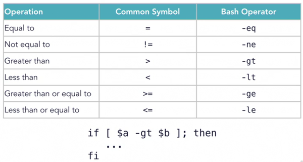

# Linux notes

Linux notes and a lose follow-along of linux tips weekly on linkedin learning by Scott Simpson

## Follow along of linux tips weekly

### Foundations

#### Distributions and derivatives

- Red Hat Enterprise Linux (RHEL)
  - commercial server enterprise linux with branding and commercial support 
  - Derivatives
    - CentOS: 
      - Free (and without commercial support) Server alternative to and derived from Red Hat Enterprise Linux.
      - each release is supported for 10 years 
      - PM (packet manager): rmp + yum front end
    - Fedora
      - used to evaluate what might be added to RHEL
      - cutting edge features, short support window
      - for developers, needs troubleshooting
      - PM: dnf
    - others: Scientific Linux, Oracle Linux, Amazon Linux
- Debian
  - Derivatives:
    - Ubuntu
      - focuses on ease of use
      - desktop, server, power- and casual users
      - GNOME desktop (since 2018)
      - 2 releases per year, 2nd one with long term support release (LTS)
      - PM: dpkg and apt
      - Ubuntu itself has many derivatives
    - Mint
      - based on the current Ubuntu LTS release 
      - Focus: ease of use and media compatibility
      - includes some closed-source software
    - others: Raspbian, SteamOS, Kali, ...
- Suse
  - OpenSUSE / SUSE Linux enterprise 
- Many others not derived distros, notably
  - alpine: minimalism and security, popular as small docker image base 
  - arch linux: steep learning curve but excellent documentation
  - gentoo
  - Android
  - ChromeOS (based on Gentoo)
  - macOS - not linux but BSD based

#### Core utilities (GNU coreutils)

A standard set of commands that are present in virtually all linux distros (sometimes replaced by the busybox 
package with similar commands). They can be shown using `apt show coreutils`:

    [...]
    arch base64 basename cat chcon chgrp chmod chown chroot cksum comm cp
    csplit cut date dd df dir dircolors dirname du echo env expand expr
    factor false flock fmt fold groups head hostid id install join link ln
    logname ls md5sum mkdir mkfifo mknod mktemp mv nice nl nohup nproc numfmt
    od paste pathchk pinky pr printenv printf ptx pwd readlink realpath rm
    rmdir runcon sha*sum seq shred sleep sort split stat stty sum sync tac
    tail tee test timeout touch tr true truncate tsort tty uname unexpand
    uniq unlink users vdir wc who whoami yes

Install location varies by distro, in Linux Mint they are located in `usr/bin`. Sometimes these are replaced by 
similar commands built into the shell.

Further info can be obtained by `man [command]` or `info coreutils`; also see [cheat.sh](#cheatsh) below.

#### Linux on a virtual private server

azure / google cloud / digitalocean

Digital ocean terminology: droplet = virtual machine

Example First steps for securing a vps on a digitalocean droplet:

    # enable firewall and only enable ssh port for now
    # USE THIS ORDER or the firewall will kick you out of the ssh session
    ufw allow 22/tcp
    ufw enable
    # program to keep track of failed login attempts
    apt install fail2ban
    # create a user beside root user
    adduser username
    # add to admin group
    usermod -aG sudo username
    # switch to user 
    su username
    # add ssh key for user
    mkdir ssh
    nano .ssh/authorized_keys
    # paste public key into the file created in digitalocean UI

### System basics

#### File system

- provides a predictable location for files across distributions
- Bases filesystem at `/` (root)
- data can be relocated to other discs and remain in the same place in the filesystem

##### Folder Overview
    /               Filesystem root
    ├── bin         Binaries the system needs incl. shell, ls, cat...
    ├── boot        Kernel and initial ram disk
    ├── dev         References do system devices
    ├── etc         Configuration files (e.g. apache, x11, hosts file etc)
    ├── home        Users home folder
    ├── lib         Libraries associated with system binaries
    ├── media       Mount point for removable media
    ├── mnt         Mount point for HDs, network shares etc
    ├── opt         User installed software
    ├── proc        Represents kernel and process information as files
    ├── root        Home folder for root user (why is there android / snap stuff here?)
    ├── run         Information about running processes (PIDs, locks etc)
    ├── sbin        System binaries
    ├── srv         Files served by the system (by ftp or other)
    ├── sys         Represents parts of the system (fs, devices, etc)
    ├── tmp         Temporary info / files (with lose permissions)
    ├── usr         Another location for system and user binaries
    ├── var         Files that can vary (logs etc) but are not temporary

##### PATH

The `PATH` variable stores where the system looks for binaries when a command is entered in the shell.

    echo $PATH
    /usr/local/sbin:/usr/local/bin:/usr/sbin:/usr/bin:/sbin:/bin:/usr/games:/usr/local/games:/snap/bin

##### Useful filesystem related commands

- `which [command]` shows the file in the path that's being used for a given command:
- `locate [string or regex]` fast search outside the PATH; underlying database can be stale; daily updated. When using locate 
  '*.h', only files that *end with* `.h` are found, not .html. Without the brackets, also .html, .hash etc. are found.
- `find [string or regex` slower but live checks all files

#### Command line and useful commands to search for commands

- General command pattern: `command options arguments`
- Use `\` for line continuation at the end of the line or escape characters
- Use `apropos [search term]` to show commands with descriptions that contain the search term, e.g. `apropos tree`
- To find out more about a command, use `man [command]` or for the youtube generation `curl cheat.sh/[command]

#### Keyboard shortcuts

- `Ctrl-C`: Ends a task
- `Ctrl-A` / Ctrl-E: Jump to start / end of line respectively
- `Ctrl-Z`: Suspend a task (use `jobs` to see and `fg` (foreground) and `bg` (background) to manipulate them). For 
  example, while editing something in nano or vim, press `ctrl-z`, do whatever needs to be done in the shell and 
  then type `fg` to get back into the suspended editor
- `Ctrl-D`: End of file / end of input
- Copy / cut / paste related: use ctrl+shift instead of just shift with the usual secondary keys, e.g. ctrl-shift-x 
  to cut

#### Sudo access and root

- Root is the superuser, no restrictions on any file
- Is used to perform administrative tasks
- User ID is always 0
- Logging in as user is not recommended
- use `sudo` to access the superusers privileges temporary with other users
  - sudo users / groups are defined in /etc/sudoers
  - the file MUST be edited with visudo (`sudo visudo`) for syntax checking
  - Usage: `sudo [command]` to execute a single command as superuser
  - `sudo` with various options:
    - `sudo -i` run target users shell and switch into its home (usually `/root`)
    - `sudo -s` same but switch in invoking user's shell
    - `sudo -l` show sudo privileges of current user
    - `sudo -u` specify a user to operate as
  - Logs are kept of commands that are run with `sudo`
  - Five minute timer until reauthentication started on each sudo command
  - `sudo -k` expires the timer immediately

#### Exploring a system

- Find distro / relase with `cat /etc/*release`
- `hostnamectl` shows system hostname, kernel and related
- `uname -a` pretty much like hostnamectl but condensed into one line
- `uptime` uptime and system load in the past 1, 5 and 15 minutes (0-[systems number of cores]); if the number is 
  higher than the number of cores, the system can't keep up with demands. If higher, all is fine.
- `df -h` gives an overview of filesystem's disk space usage (`-h`for human readable)
- `free` ram / swap related information
- `who`  who else is logged on 
- `systemctl` system services and statuses; `systemctl | grep running` to show running services only. `systemctl 
  status [service]`, e.g. `systemctl status syslog` or `systemctl status docker` to show status and log of a running 
  service
- `top` shows processes / ressources.
  - `x` to highlight current sort column, choose column to sort by using `<` and `>`; `R` to reverse sort order; 
    `h`for help
- `ip a` or `ifconfig` for network information

#### Exploring bash

- Auto completion for commands, arguments or files with `tab` key; double-tab to show all possibilities that start with 
  the typed in substring.
  - Brace expansion (useful for e.g. creating a large number of files)

        pk@pk-lightshow:/$ echo h{e,a,u}llo
        hello hallo hullo
        pk@pk-lightshow:/$ echo h{a..c}llo
        hallo hbllo hcllo
        pk@pk-lightshow:/$ echo h{c..a}llo
        hcllo hbllo hallo
        pk@pk-lightshow:/$ echo h{1..3}llo
        h1llo h2llo h3llo
        # with interval
        pk@pk-lightshow:/$ echo h{0..100..25}llo
        h0llo h25llo h50llo h75llo h100llo
        pk@pk-lightshow:/$ echo {a..z}{a..z}{0..9}
        pk@pk-lightshow:~/projects$ echo {a..z}{a..z}{0..9}
        aa0 aa1 aa2 aa3 aa4 aa5 aa6 aa7 aa8 aa9 ab0 ab1 ab2 ab3 ab4 ab5 ab6 ab7 ab8 ab9 ac0 ac1 ac2 ac3 ac4 ac5 ac6 ac7
        ac8 ac9 ad0 ad1 ad2 ad3 ad4 ad5 [...]

- command substitution: `$([command])` or `` `[command]` `` takes output of command and return it as a string., e.g. 
  `echo it is $(date)` or ``echo it is `[date]` ``
- `Ctrl-R`: type command / search term and press ctrl-r to cycle through command line history; press enter to redo
    current command or tab to edit before executing
- show command `history` and execute a line from it using `![nr]`, e.g. `!150`
- execute previous command with `!!`. Good when forgetting to sudo a command: `sudo !!` 

#### Bash scripting basics

Executable scripts start `#!`(*shebang*) with the path to the interpreter, e.g. `#!/usr/bin/python`.

In case of bash scripts, this is `#!/usr/bin/env bash` (why env bash?).

Scripts can be run using `bash script.sh` or directly when made executable by setting the executable bit (`chmod +x 
script.sh`).

Example script:

    #!/usr/bin/env bash
    myvar=42
    # read variable with a prompt
    read -p "What is your name? " name
    # variables are refered to with a dollar sign
    echo "Hello, $name, the meaning of life is $myvar"
    # command substitution as usual
    echo "And the date is $(date)"

#### The bash prompt

Usual format: `username@hostname:currentDirectory$`, e.g. `pk@pk-lightshow:~/projects/linux$`

The prompt can be set using the PS1 environment variable in the ~/.bashrc file

    echo $PS1
    \[\e]0;\u@\h: \w\a\]${debian_chroot:+($debian_chroot)}\[\033[01;32m\]\u@\h\[\033[00m\]:\[\033[01;34m\]\w\[\033[00m\]\$

[online bashrc prompt generator](http://bashrcgenerator.com/)

To temporarily (only in the current session), use `export PS1="[prompt code]"`

e.g.

    pk@pk-lightshow:~$ export PS1="\[\033[38;5;12m\]\u\[$(tput sgr0)\]\w:\[$(tput sgr0)\]"
    pk~:

PS2 defines the prompt displayed for line continuation.

#### Bash output redirection

3 basic streams: 0 stdin (default: keyboard input), 1 stdout (terminal), 2 stderr (terminal).

Redirectors:

- `|` pipe output to a command, e.g. `ls -l | grep doc` to show only directory names containing "doc"
- `>` redirect output to a file (replace content if it exists)
- `>>` redirect output and append to a file
- `<` use file as input
- `<<` take input until token: `wc << EOF` reads input until end of file (ctrl-D, or "EOF")

      pk@pk-lightshow:~$ wc << EOF
      > blab blubb
      > EOF
      1  2 11

Example of finding files but redirecting all error messages (as the user doesn't have access to all folders) to null:

    find / -name "linux"  2>/dev/null

#### Bash expansion and substitution

Same as under [exploring bash](#exploring-bash).

Create 30 files with expansion

    pk@pk-lightshow:~/tmp$ touch file{a..c}{1..10}.log
    pk@pk-lightshow:~/tmp$ ls
    filea10.log  filea5.log  fileb10.log  fileb5.log  filec10.log  filec5.log
    [...]

Create multiple directories:

    mkdir /home/pk/tmp/{logs,cache,wads}
    mkdir -p /home/pk/tmp/{a..z}/{1-100}/{z..a}

- `~` = user's homefolder (e.g. `/home/pk`)
- `$(command)` -> command substitution (command output can be used as argument)

#### Bash aliases and functions

Both aliases and functions have to be added to the .bashrc file to be permanent of course.

##### Aliases

- `alias lg="ls -l --group-directories-first"` assigns the ls command with parameters to the `lg` alias
- `alias` shows assigned command aliases
- `alias [command]` shows specific alias information (e.g. `alias ll`)
- if a command is overwritten with an alias, the original command can be executed with a `\`, e.g. `\ls`
- remove with `unalias [command]`

##### Functions

`function greplog () { grep $1 /var/log/syslog; }`

#### Bash arithmetic and equality operators

Arithmetics (ONLY integers) must be enclosed by two brackets:

    pk@pk-lightshow:~/tmp$ echo $(( 2**16 ))
    65536

Supported operators: `+, -, *, /, **, %`

Equality operators in a nutshell:

Boolean operators to check files and folders:
    
    # the spaces before and after [ and ] are important!
    if [ -e myfile ]; then echo "file exists"; fi

    # spacecheck.sh
    #!/usr/bin/env bash
    space=$(df -k / | awk 'FNR == 2 {print 4}')
    if [ $space -lt $((50*1000*1000)) ]
    then
      echo "/ has LESS than 50 GB available"
    else
      echo "/ has MORE than 50 GB available"
    fi

#### System logs

- keep track of system activity
  - Debian: /var/log/syslog
  - Red Hat: /var/log/messages
- Other application logs
  - Package manager: `/var/log/dpkg.log`
  - Activites requiring authorization: `/var/log/auth.log`
  - etc.

Using `less` to view a log, we can use `f` and `b` to go forward and backward, `/` to search, enter for next match, 
`/` + enter for new search. Show only lines containing a search term by typing `&/searchterm`, to exit `&` again.

System logs are handled by `rsyslogd`, which can be configured in `/etc/rsyslog.conf`.

We can write to the system logs by using `logger`:

    pk@pk-lightshow:~/tmp$ logger "hey there"
    pk@pk-lightshow:~/tmp$ tail -1 /var/log/syslog
    Aug 25 18:28:14 pk-lightshow pk: hey there

`rsyslog` can be configured to send and accept logs over the network.

Logs rotate and get archived into compressed files, this can be configured in `/etc/logrotate.conf` and 
`/etc/logrotate.d`.

Archived files can be viewed with `zcat` and `zless`

## Not course related

### adding commands to bash using .bashrc
To not clutter the .bashrc and for easier backup, create new commands in a separate file (e.g. .bash_own_functions.sh) and include them somewhere in the .bashrc (source ~/.bash_own_functions.sh).

### cheat.sh
Very useful to quickly look up the most common use cases of a command.  
Usage:  

    curl cheat.sh/commandname

Example:  

    curl cheat.sh/tar

Or add it in the .bashrc / own functions file:

    cheat () {
        curl cheat.sh/"$1"
    }

### commands

#### tac

Shows lines in a file in reverse order (reversed `cat`)

#### xargs and backticks to pipe output of command1 into command2
Output directory of first mach of locate

    locate --limit 1 DOOM2.WAD | grep -o "^.*\/" | xargs ls

Ask show confirmation prompt before executing the command xargs pipes into (-p option):

    locate --limit 1 DOOM2.WAD | grep -o "^.*\/" | xargs -p ls

This does not work as cd is an in-built shell command, but xargs opens a new process, so state changes don't propagate to parent process (shell); effectively, this means that xargs can only execute stand alone commands.

    locate --limit 1 DOOM2.WAD | grep -o "^.*\/" | xargs cd

This works (NOT using xargs):
  
    cd `locate --limit 1 DOOM2.WAD | grep -o "^.*\/"`

Or, using xargs again and dirname command:

    cd `locate --limit 1 DOOM2.WAD | xargs dirname`

#### Background tasks with nohup / screen

##### nohup

Lets a process run in the background (you can log out from the terminal / server and it keeps running); Command output is by default to nohup.log in the current directory. Installed by default on most systems.
    nohup <command>

##### screen
Creates multiple (and optionally named) terminals; Usually must be installed first.  
Usage:
    screen
Keys:
Ctrl+key commandkey (press ctrl and key simultaneously, then release and press command key)  
- Ctrl+a c -> create a new window / shell
- Ctrl+a " -> list active screens and select with cursor + enter
- Ctrl+a A -> rename current screen
- Ctrl+a d -> detach from screen session (shells and processes in shells will continue running, you could log out now)
- screen -r -> resumes a detached screen session
- screen -ls -> find active screen session(s), reattach to a specific one with screen -r <number at front of session name before .pts[...]>

#### Give a specified group make a directory access to a folder

Can be useful to give own user and apache write access to a folder that is linked in htdocs.

Here, we want to give the user "pk" and "daemon" write (and read / execute) access to the folder php_notes.
    
    # create new group (if necessary)
    sudo groupadd pkandapache
    # add users to group
    sudo usermod -a -G pkandapache pk
    sudo usermod -a -G pkandapache daemon
    # change group owner of folder to pkandapache
    sudo chgrp -R pkandapache php_notes
    # set permissions as necessary, first digit = owner, second = group, third = everyone else
    # digit = rwx in binary, so read + execute = 1 0 1 = 5
    chmod -R 775 php_notes/

#### Remove alt-click behaviour so you can use IntelliJ alt-shift-click to set new carets without changing the keymap

In Mint(or Cinnamon) the key can be changed or disabled under

system settings > windows > behavior > 'Special key to move and resize window'

#### Open port
        
        E.g. to fix IntelliJ / PHPStorm not accepting incoming XDebug connections on port 9003 from Docker

        sudo iptables -A INPUT -p tcp -d 0/0 -s 0/0 --dport 9003 -j ACCEPT
        
        OR 
        
        sudo ufw allow <port_nr>
        
        
#### nc

Among other things (try curl cheat.sh/nc for common usages) useful for logging traffic on a specific port:

    nc -l 9003 > xdebug3connections.log
    

#### Use command output as command parameters

use command1 $(command2) to use command2's output as parameters for command2:

`docker rm $(docker ps -a -f status=exited -q)`
